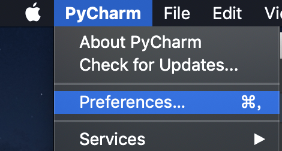
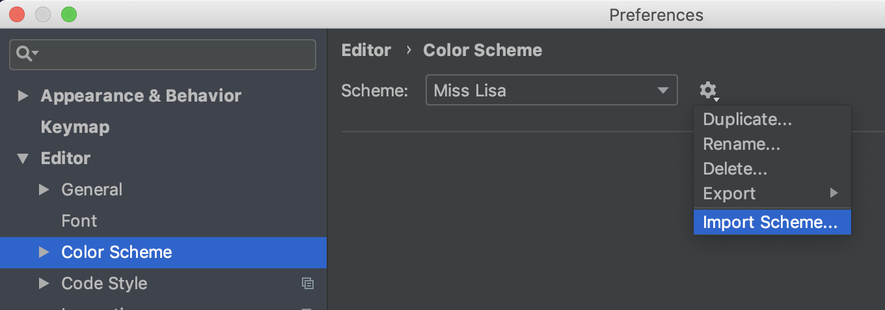

## Miss Lisa Theme for JetBrains IDE

It's available for python.

### Overview

> This theme is inspired from the theme *Ladies Night 2* [Link](http://color-themes.com/?view=theme&id=566065a4ddacef1b003edb63)


### Usage

1. Open the ```Preferences...``` 

   

2. Go to ```Editor -> Color Scheme,``` and ```Import the scheme...``` 

   

You can find this theme on [GitHub](http://github.com/kevinleeex/miss-lisa-theme)

